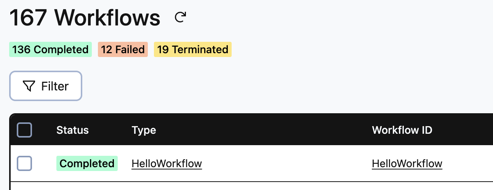

# Temporal Replayer
The temporal-replayer is a sample that shows you how to safely attempt a rollout of new workflow code and ensure it doesn't cause non-determinism errors for existing in-flight workflows. Success with temporal-replayer means you can proceed with replacing your old workers with your new workers (running your new workflow code) with peace of mind that your in-progress and future workflows will complete.

## How it works?
Perform a Temporal Workflow Replay as part of k8s deployment.

An init container is used to run Workflow Replay. The event history is pulled from prior execution with previous release, against new release and code updates. It ensures that any new code changes to Workflow, don't break Workflow determinism. 

If the Workflow Replay fails, the init container will error and the deployment of the new worker won't occur.

If Workflow Replay succeeds, the deployment of the new worker code will occur.

## Environment Settings
```bash
TEMPORAL_WORKFLOW_ID=HelloWorkflow
TEMPORAL_ADDRESS=<Namespace>.<AccountId>.tmprl.cloud:7233
TEMPORAL_TASK_QUEUE=hello
TEMPORAL_NAMESPACE=<Namespace>.<AccountId>
TEMPORAL_CERT_PATH=/etc/certs/tls.crt
TEMPORAL_KEY_PATH=/etc/certs/tls.key
```

## Run Workflow (using k8s job)
This will create a HelloWorkflow with existing code. This is just so you have existing Workflow event history.



```bash
$ kubectl create -f yaml/job.yaml -n <K8s Namespace>
```

## Deployment
This will deploy new code and do Workflow replay test as part of init container.

```bash
$ kubectl create -f yaml/deployment.yaml -n <K8s Namespace>
```

## Deployment Scenario: Workflow Replay Succeeds
Shows scenario where Workflow replay succeeds.

```bash
kubectl get pod -n temporal-workflow-replayer
NAME                                    READY   STATUS        RESTARTS   AGE
temporal-hello-worker-6dbb76577-j8lq8   0/1     Init:0/1      0          2s
```

```bash
NAME                                    READY   STATUS            RESTARTS   AGE
temporal-hello-worker-6dbb76577-j8lq8   0/1     PodInitializing   0          73s
```

```bash
NAME                                    READY   STATUS    RESTARTS   AGE
temporal-hello-worker-6dbb76577-j8lq8   1/1     Running   0          74s
```

## Deployment Scenario: Workflow Replay Fails
Shows scenario where Workflow replay fails.

```bash
kubectl get pod -n temporal-workflow-replayer
NAME                                    READY   STATUS        RESTARTS   AGE
temporal-hello-worker-59d6b8c8f-f7vp8   0/1     Init:0/1      0          3s
```

```bash
NAME                                    READY   STATUS       RESTARTS   AGE
temporal-hello-worker-59d6b8c8f-f7vp8   0/1     Init:Error   0          74s
```


